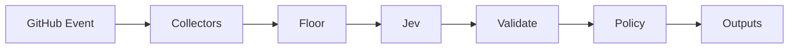

# JEV Pull Request Profiler

[](https://github.com/JevForge/jev-pr-profiler/releases)
[](LICENSE)
[](https://github.com/marketplace/actions/jev-pull-request-profiler)
[](https://github.com/JevForge/jev-pr-profiler/actions/workflows/ci.yml)

**Evaluate pull request complexity and blast radius** using [TypeSafe Jev](https://vercel.com/ai-gateway/models/jev) as a typed decision layer inside GitHub Actions.

Reviewers need a consistent signal for how deep a review should go and which verification gates matter. This Action collects PR metadata and a compact diff summary (plus optional security, coverage, and incident evidence), asks Jev for a structured risk profile, then exposes stable outputs your workflow can branch on. It **never** approves, merges, or blocks merge on its own—downstream jobs decide what to do.

```yaml
- id: profile
  uses: JevForge/jev-pr-profiler@v0.1.0
  env:
    AI_GATEWAY_API_KEY: ${{ secrets.AI_GATEWAY_API_KEY }}
  with:
    create_check_run: true
    low_confidence_policy: request-review
```

## Features

* Typed PR risk profiling powered by Jev (`experimental_evaluate`, not free-form generation)
* Deterministic risk floor from diff size, sensitive paths, labels, and optional evidence
* Secret-based authentication (`AI_GATEWAY_API_KEY`, `TYPESAFE_API_KEY`, or `JEV_CUSTOM_API_KEY`)
* Structured outputs for later steps (`risk_level`, `review_depth`, `recommended_checks`, …)
* Compact PR file metadata only—never patch hunks or full file contents
* Optional PR comments, managed `jev:risk:*` / `jev:review-depth:*` labels, Check Runs, and reviewer requests
* Schema + allowlist validation; Jev prose is never executed
* Configurable low-confidence policy: `fail` | `warn` | `request-review` | `no-op`

## How it works

```text
Pull Request event
        ↓
Collect metadata + compact diff signals
        ↓
Optional security / coverage / incidents
        ↓
Deterministic risk floor
        ↓
Jev typed evaluation
        ↓
Schema validate + raise to floor + confidence policy
        ↓
Action outputs (+ optional comment / labels / check / reviewers)
        ↓
Next CI/CD step
```



1. Read PR title, body excerpt, labels, and changed-file metadata (paths and line counts).
2. Optionally load security findings, coverage delta, and incident history from workspace JSON.
3. Compute a **deterministic floor** that Jev cannot weaken.
4. Call Jev through `jev_provider` (no silent provider fallback).
5. Validate enums/allowlists; merge recommended checks with the floor; apply `low_confidence_policy`.
6. Emit outputs. Free-form `explanation` is display-only.

## Demo

```text
Pull Request: "Harden auth session cookies"
        ↓
Diff: src/auth/* + workflow YAML, +120/-40
        ↓
Jev → risk_level = HIGH
      review_depth = EXPERT
      recommended_checks = [security_scan, unit_tests, ...]
      decision = PROFILE
      confidence = 0.91
        ↓
Workflow requests security reviewers and runs security_scan
```

## Quick Start

1. Add repository secret `AI_GATEWAY_API_KEY` (default provider).
2. Add a workflow:

```yaml
name: PR Profiler
on:
  pull_request:

permissions:
  contents: read
  pull-requests: write
  checks: write

jobs:
  profile:
    runs-on: ubuntu-latest
    steps:
      - uses: actions/checkout@v4

      - id: profile
        uses: JevForge/jev-pr-profiler@v0.1.0
        env:
          AI_GATEWAY_API_KEY: ${{ secrets.AI_GATEWAY_API_KEY }}
        with:
          comment_on_github: true
          apply_labels: true
          create_check_run: true
          low_confidence_policy: request-review

      - name: Show profile
        run: |
          echo "decision=${{ steps.profile.outputs.decision }}"
          echo "risk=${{ steps.profile.outputs.risk_level }}"
          echo "depth=${{ steps.profile.outputs.review_depth }}"
          echo "checks=${{ steps.profile.outputs.recommended_checks }}"
```

Pin `@v0.1.0` for reproducibility, or `@v0` for the floating major line.

## Complete Example

See:

* [`examples/basic.yml`](examples/basic.yml) — minimal outputs-only run
* [`examples/pr-profile.yml`](examples/pr-profile.yml) — comment, labels, check, optional evidence, reviewer requests
* [`examples/gate.yml`](examples/gate.yml) — branch later jobs on `risk_level` / `recommended_checks`

## Inputs

| Input | Required | Default | Description |
| ----- | -------- | ------- | ----------- |
| `pull_number` | no | event PR number | Pull request number override |
| `title` | no | event title | Optional PR title override |
| `body` | no | event body | Optional PR body override |
| `labels` | no | event labels | JSON array or comma-separated labels |
| `changed_paths` | no | API listing | JSON/comma paths when not on `pull_request` |
| `max_files` | no | `100` | Max files summarized for Jev |
| `include_security_findings` | no | `true` | Load optional security evidence |
| `security_findings_path` | no | `.jev/security-findings.json` | Findings JSON path |
| `include_coverage` | no | `true` | Load optional coverage evidence |
| `coverage_path` | no | `.jev/coverage.json` | Coverage summary path |
| `include_incidents` | no | `true` | Load optional incident evidence |
| `incidents_path` | no | `.jev/incidents.json` | Incidents JSON path |
| `min_confidence` | no | `0.7` | Minimum confidence to trust the profile |
| `low_confidence_policy` | no | `fail` | `fail` \| `warn` \| `request-review` \| `no-op` |
| `jev_provider` | no | `vercel-ai-gateway` | How to reach Jev |
| `jev_endpoint` | no | — | HTTPS endpoint for native/custom |
| `jev_model` | no | — | Required for native/custom; Gateway uses `typesafe-ai/jev` |
| `timeout_ms` | no | `45000` | Remote call timeout |
| `comment_on_github` | no | `false` | Post/update idempotent PR comment |
| `apply_labels` | no | `false` | Apply managed `jev:*` labels |
| `create_check_run` | no | `true` | Create Check Run on head SHA |
| `request_reviewers` | no | — | Users / `team:slug` for HIGH/CRITICAL or EXPERT |
| `write_report_artifact` | no | `false` | Write `.jev/pr-profiler-report.*` |
| `structured_logs` | no | `false` | Emit one JSON evidence log line |
| `dry_run` | no | `false` | Skip mutating GitHub writes |
| `github_token` | no | `${{ github.token }}` | For files/comments/labels/checks/reviewers |

## Outputs

| Output | Description |
| ------ | ----------- |
| `decision` | `PROFILE` \| `ABSTAIN` \| `REQUEST_REVIEW` |
| `risk_level` | `LOW` \| `MEDIUM` \| `HIGH` \| `CRITICAL` |
| `review_depth` | `LIGHT` \| `STANDARD` \| `THOROUGH` \| `EXPERT` |
| `recommended_checks` | JSON array of allowlisted check ids |
| `confidence` | `0`–`1` |
| `reason_codes` | JSON array of stable reason codes |
| `explanation` | Display-only text (never executed) |
| `provisional` | `true` when not a confident live Jev profile |
| `jev_status` | `evaluated` \| `unavailable` \| `schema_rejected` |
| `policy_floor_risk` | Deterministic floor risk |
| `summary` | One-line log summary |
| `label_status` | `applied` \| `dry-run` \| `skipped` |
| `check_status` | `created` \| `dry-run` \| `skipped` |
| `comment_status` | `posted` \| `updated` \| `dry-run` \| `skipped` |
| `reviewers_status` | `requested` \| `dry-run` \| `skipped` |
| `report_markdown_file` | Path when `write_report_artifact` is true |
| `report_json_file` | Path when `write_report_artifact` is true |
| `file_count` | PR files summarized |
| `additions` | Lines added |
| `deletions` | Lines deleted |

### Using outputs in conditions

```yaml
- name: Run security scan
  if: contains(fromJSON(steps.profile.outputs.recommended_checks), 'security_scan')
  run: echo "Start security_scan job"

- name: Extra review for high risk
  if: steps.profile.outputs.risk_level == 'HIGH' || steps.profile.outputs.risk_level == 'CRITICAL'
  run: echo "Escalate review"

- name: Human review required
  if: steps.profile.outputs.decision == 'REQUEST_REVIEW'
  run: echo "Profile needs a human look"
```

## Authentication

Create a repository secret:

```text
Repository → Settings → Secrets and variables → Actions → New repository secret
```

| `jev_provider` | Secret name | Notes |
| -------------- | ----------- | ----- |
| `vercel-ai-gateway` (default) | `AI_GATEWAY_API_KEY` | AI SDK `experimental_evaluate` + `typesafe-ai/jev` |
| `typesafe-native` | `TYPESAFE_API_KEY` | Requires pinned `jev_model` |
| `custom-compatible` | `JEV_CUSTOM_API_KEY` | Requires HTTPS `jev_endpoint` + `jev_model` |

**Never** put API keys in workflow YAML, logs, or Issues. There is **no silent fallback** between providers.

Optional local config: [`examples/.jev/config.yml`](examples/.jev/config.yml) (inputs override file values).

## Why JEV?

Jev is TypeSafe’s evaluation model for **structured decisions**, not chat. This Action needs allowlisted enums for `risk_level`, `review_depth`, and recommended checks—plus confidence and optional abstain/review signals. Jev returns typed answers (`choice` / `boolean`) that code can validate and raise against a deterministic floor. Generative text would be unsafe to treat as a check id or GitHub operation. That is why the Action uses `experimental_evaluate` and never `generateText` for the decision.

## Data Sent to JEV

Only:

* sanitized PR title and short body excerpt (truncated; secrets redacted)
* labels, author login, draft flag, commit count
* compact diff metadata (paths, languages, +/- counts, sensitive/auth/infra/test flags)
* optional compact security / coverage / incident summaries
* confidence constraints

Never: GitHub tokens, API keys, patch hunks, full file contents, or raw scanner dumps.

## Permissions

Outputs + PR file listing only:

```yaml
permissions:
  contents: read
  pull-requests: read
```

Comments, labels, Check Runs, and reviewer requests:

```yaml
permissions:
  contents: read
  pull-requests: write
  checks: write
```

## Decision model

* **Jev** proposes `risk_level`, `review_depth`, and recommended checks from allowlists.
* **Deterministic floor** raises risk/depth/checks from evidence; Jev cannot lower below the floor.
* **Executor** only writes GitHub effects from enums. `explanation` is display-only.
* Low confidence / unavailable / schema rejection follows `low_confidence_policy`.

### ABSTAIN vs floor risk

When Jev returns `ABSTAIN` (or is unavailable), the Action does **not** leave risk empty for consumers. Policy converts the outcome to `decision=REQUEST_REVIEW` and fills `risk_level` / `review_depth` / `recommended_checks` from the deterministic floor. Look for `FLOOR_AFTER_ABSTAIN` (or `JEV_UNAVAILABLE`) in `reason_codes`, and treat `provisional=true` as “not a confident live Jev profile”.

```text
Jev ABSTAIN
     ↓
decision = REQUEST_REVIEW
risk_level / review_depth = floor values
reason_codes includes FLOOR_AFTER_ABSTAIN
provisional = true
```

### Valid decision example

```json
{
  "decision": "PROFILE",
  "risk_level": "HIGH",
  "review_depth": "THOROUGH",
  "recommended_checks": ["unit_tests", "security_scan", "codeowners_review"],
  "confidence": 0.91,
  "reason_codes": ["SENSITIVE_PATHS", "AUTH_SECURITY_TOUCH"],
  "explanation": "Auth module + workflow changes",
  "provisional": false,
  "jev_status": "evaluated",
  "policy_floor_risk": "HIGH"
}
```

### Invalid responses the schema rejects

* unknown `risk_level` / `review_depth`
* non-allowlisted `recommended_checks` (for example shell-looking strings)
* `PROFILE` without `risk_level` or `review_depth`

## Optional evidence files

| Path (defaults) | Purpose |
| --- | --- |
| `.jev/security-findings.json` | Finding list or severity summary |
| `.jev/coverage.json` | Coverage head/base/delta |
| `.jev/incidents.json` | Recent incidents for touched components |

Disable with `include_security_findings`, `include_coverage`, or `include_incidents` set to `false`.

## Versioning

```yaml
uses: JevForge/jev-pr-profiler@v0.1.0   # recommended pin
uses: JevForge/jev-pr-profiler@v0       # floating major (v0.x)
```

### Cutting a release (CI)

1. Merge to `main` with `dist/` up to date (`npm run build`).
2. **Actions → Release → Run workflow** on `main` with version `X.Y.Z` (uses [jev-release-forge](https://github.com/JevForge/jev-release-forge)), or push tag `vX.Y.Z`.
3. CI publishes the GitHub Release and moves floating major tag `v0`.

Marketplace listing updates need one browser step (GitHub 2FA): open the release and keep **Publish this Action to the GitHub Marketplace** checked.

See [CHANGELOG.md](CHANGELOG.md) and [Releases](https://github.com/JevForge/jev-pr-profiler/releases).

## Development

Requires Node.js 24+.

```bash
npm ci
npm run typecheck
npm test
npm run build
```

Consumers run bundled `dist/index.js` (`runs.using: node24`) and do not need to install dependencies.

## Contributing

See [CONTRIBUTING.md](CONTRIBUTING.md). Report bugs via Issues—**never** include API keys or tokens.

## Security

See [SECURITY.md](SECURITY.md).

## License

[MIT](LICENSE)
