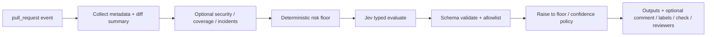

# JEV Pull Request Profiler

[](https://github.com/marketplace/actions/jev-pull-request-profiler)

GitHub Action that evaluates pull request complexity and blast radius with **Jev**, then recommends a stable `risk_level`, `review_depth`, and allowlisted `recommended_checks`.

It **never** approves, merges, or blocks merge on its own. Downstream workflows decide what to do with the outputs.

## Problem

Reviewers need a consistent signal for how deep a review should go and which verification gates matter — without letting model prose become shell commands or merge decisions.

## How it works



1. Collect PR metadata, labels, and compact diff signals (paths + line counts only).
2. Optionally load security findings, coverage delta, and incident history.
3. Compute a **deterministic floor** that Jev cannot weaken.
4. Ask Jev (via configurable provider) for a typed profile.
5. Validate enums, merge checks with the floor, apply low-confidence policy.
6. Emit outputs; optionally comment, label, create a check run, or request reviewers.

## Quick start

```yaml
name: PR profile
on:
  pull_request:

permissions:
  contents: read
  pull-requests: write
  checks: write

jobs:
  profile:
    runs-on: ubuntu-latest
    steps:
      - uses: actions/checkout@v4
      - uses: JevForge/jev-pr-profiler@v0
        with:
          comment_on_github: true
          apply_labels: true
          create_check_run: true
          low_confidence_policy: request-review
        env:
          AI_GATEWAY_API_KEY: ${{ secrets.AI_GATEWAY_API_KEY }}
```

Pin a release tag or commit SHA for production.

## Inputs / outputs

See [`action.yml`](./action.yml) for the full contract. Core outputs:

| Output | Description |
| --- | --- |
| `decision` | `PROFILE` \| `ABSTAIN` \| `REQUEST_REVIEW` |
| `risk_level` | `LOW` \| `MEDIUM` \| `HIGH` \| `CRITICAL` |
| `review_depth` | `LIGHT` \| `STANDARD` \| `THOROUGH` \| `EXPERT` |
| `recommended_checks` | JSON array of allowlisted check ids |
| `confidence` | `0..1` |
| `reason_codes` | Stable machine-readable codes |
| `provisional` | `true` when not a confident live Jev profile |

## Jev providers

| `jev_provider` | Credential | Notes |
| --- | --- | --- |
| `vercel-ai-gateway` (default) | `AI_GATEWAY_API_KEY` | AI SDK `experimental_evaluate`, model `typesafe-ai/jev` |
| `typesafe-native` | `TYPESAFE_API_KEY` | Requires `jev_model` |
| `custom-compatible` | `JEV_CUSTOM_API_KEY` | Requires HTTPS `jev_endpoint` + `jev_model` |

No silent fallback between providers. Configure via input or `.jev/config.yml`.

## Decision model

- **Jev** proposes `risk_level`, `review_depth`, and a primary recommended check from allowlists.
- **Deterministic floor** raises risk/depth/checks from diff size, sensitive/auth/infra paths, labels, security findings, coverage drops, and incident history.
- **Executor** only writes GitHub comments/labels/checks/reviewer requests from enums. Free-form `explanation` is display-only.
- Low confidence / unavailable / schema rejection follows `low_confidence_policy`: `fail` \| `warn` \| `request-review` \| `no-op`.

### Valid decision example

```json
{
  "decision": "PROFILE",
  "risk_level": "HIGH",
  "review_depth": "THOROUGH",
  "recommended_checks": ["unit_tests", "security_scan", "codeowners_review"],
  "confidence": 0.91,
  "reason_codes": ["SENSITIVE_PATHS", "AUTH_SECURITY_TOUCH"],
  "explanation": "Auth module + workflow changes",
  "provisional": false,
  "jev_status": "evaluated",
  "policy_floor_risk": "HIGH"
}
```

### Invalid responses the schema rejects

- `risk_level: "SUPER_HIGH"` (unknown enum)
- `recommended_checks: ["curl evil.example"]` (not allowlisted)
- `decision: "PROFILE"` without `risk_level` / `review_depth`
- Arbitrary text treated as a shell command or file path

## Data sent to Jev

- Sanitized PR title and short body excerpt (secrets redacted, truncated)
- Labels, author login, draft flag, commit count
- Diff summary: file counts, additions/deletions, languages, top paths, sensitive paths, touch flags
- Optional compact security / coverage / incident summaries

**Never sent:** patch hunks, tokens, full file contents, raw scanner dumps.

## Optional evidence files

| Path (defaults) | Purpose |
| --- | --- |
| `.jev/security-findings.json` | Finding list or precomputed severity summary |
| `.jev/coverage.json` | Coverage head/base/delta |
| `.jev/incidents.json` | Recent incidents related to touched components |

Disable with `include_security_findings`, `include_coverage`, or `include_incidents` set to `false`.

## Permissions

Minimum:

```yaml
permissions:
  contents: read
  pull-requests: read
```

Add `pull-requests: write` for comments/labels/reviewers and `checks: write` for check runs.

## Dry-run

`dry_run: true` computes the profile and skips mutating GitHub writes.

## Development

```bash
npm ci
npm run typecheck
npm test
npm run build
```

Consumers run the bundled `dist/index.js` (Node 24); they do not need `npm install` for the Action.

## License

MIT © JevForge
